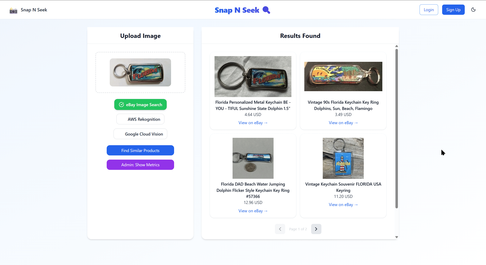
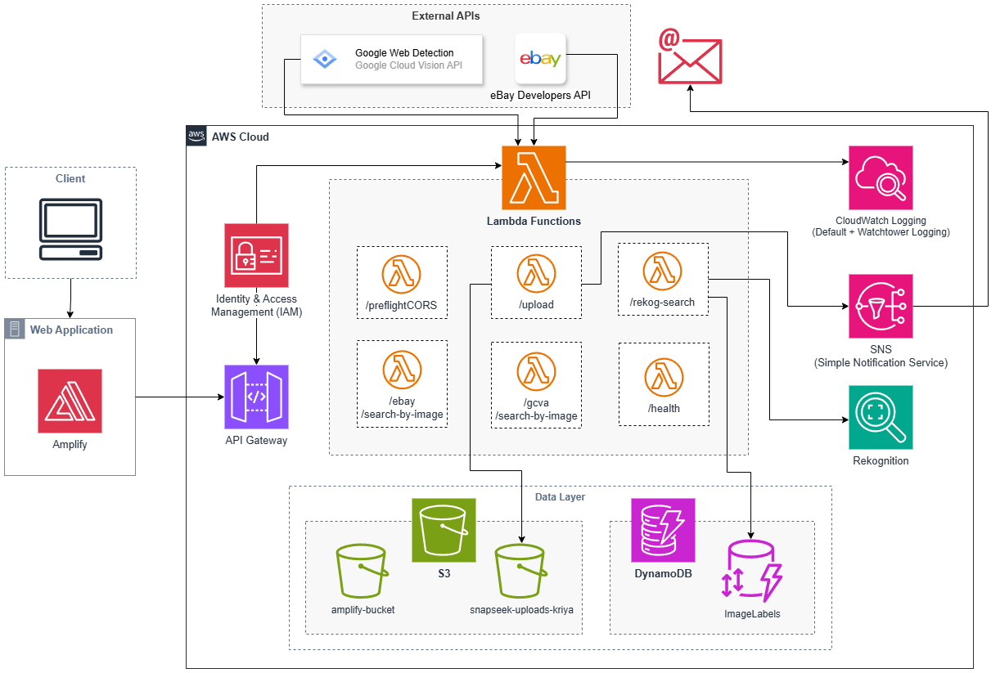

# 📸 Snap & Seek | A Cloud-Native Image-to-Product Finder

Snap & Seek is a cloud-native web application that lets users upload an image of something they can't identify (like a forgotten childhood toy, unlabelled items, memorabilia) and automatically retrieves matching or similar product listings from eBay, or displays links of other websites that contain similar images (depending on user choice).

> This project was made to roughly automate the workflow I use to find product links for items posted on the subreddit [r/helpMeFind](https://www.reddit.com/r/HelpMeFind/), and to learn AWS cloud services along the way. Some services were added more for exploration than necessity.

<br>

<div align="center">
  
</div>

<br>

It supports **three search options** users can choose between, they are:

<div align="center">

| Option | Flow |
|---|---|
| **eBay Image Search** | Sends the image directly to eBay's visual search API. |
| **AWS Rekognition** | Extracts labels from the image using AWS Rekognition, then searches eBay by keyword. |
| **Google Cloud Vision** | Uses Google's Web Detection API to find matching images and web entities. |
</div>

---

## 🗼 Architecture 

The application is fully serverless and hosted on AWS in the `ap-south-1` (Mumbai) region.

<div align="center">
  
</div>

---

## 📦 AWS Services Used

<div align="center">
  
  | Service | Purpose |
  |---|---|
  | **Amplify** | Hosts the React frontend |
  | **Lambda** | Runs the Flask backend serverlessly |
  | **API Gateway** | Routes HTTP requests to Lambda functions |
  | **S3** | Stores uploaded images + GCP credentials JSON |
  | **Rekognition** | Extracts image labels for keyword-based search |
  | **DynamoDB** | Stores image labels from Rekognition queries (`ImageLabels` table) |
  | **CloudWatch** | Default + custom logging via Watchtower; custom metrics per route |
  | **SNS** | Sends email alert to my account on every new S3 upload |
  | **IAM** | Custom roles for Lambda execution and Amplify CLI access |
</div>

---

## 🗂️ Project Structure

```
snap-and-seek/
├── frontend/                  # React SPA (hosted on Amplify)
│   ├── src/
│   │   ├── components/
│   │   │   ├── GCVADisplay.jsx       # Google Vision results renderer
│   │   │   ├── Header.jsx            # Top nav with dark mode toggle
│   │   │   ├── ImageUpload.jsx       # Upload logic
│   │   │   ├── OptionSelector.jsx    # Pipeline selector (eBay / Rekog / GCV)
│   │   │   ├── ProductCard.jsx       # eBay product result card
│   │   │   ├── ResultsDisplay.jsx    # Results panel
│   │   │   └── UploadBox.jsx         # Drag-and-drop upload box
│   │   └── pages/
│   │       └── Home.jsx              # Main page with full search flow
│
├── backend/                   # Flask app deployed on AWS Lambda
│   ├── routes/
│   │   ├── upload_routes.py          # S3 upload + SNS trigger
│   │   ├── ebay_routes.py            # eBay image search
│   │   ├── rekog_routes.py           # Rekognition + eBay keyword search
│   │   ├── gcva_routes.py            # Google Cloud Vision web detection
│   │   └── metrics_routes.py         # CloudWatch custom metrics endpoint
│   ├── services/
│   │   └── aws_clients.py            # Centralized boto3 client initialization
│   ├── utils/
│   │   └── logger.py                 # Watchtower CloudWatch logger setup
│   ├── application.py                # Flask app entry point, blueprint registration
│   ├── config.py                     # Environment variable config
│   ├── lambda_function.py            # AWS Lambda handler (serverless_wsgi)
│   ├── preflight_lambda.py           # Dedicated CORS preflight Lambda
│   └── requirements.txt
```
---

## 💻 Tech Stack

**Frontend**
- React (SPA)
- Tailwind CSS, PostCSS, Autoprefixer
- Axios
- Lucide React (icons)

**Backend**
- Python, Flask
- Flask-CORS
- boto3 (AWS SDK)
- Watchtower (CloudWatch logging)
- serverless-wsgi (Lambda deployment wrapper)
- Requests

**Cloud**
- AWS (Amplify, Lambda, API Gateway, S3, Rekognition, DynamoDB, CloudWatch, SNS, IAM)
- Google Cloud Platform (Cloud Vision API for Web Detection)
- eBay Developers API (Browse API)

---

## 👩‍💻 Setup & Deployment

### Prerequisites
- AWS CLI configured with appropriate IAM permissions
- Node.js + npm (for frontend)
- Python 3.11+ (for backend)
- eBay Developer API credentials
- Google Cloud Vision API key

### Environment Variables (Lambda)

Set the following as Lambda environment variables (Under the configuration tab):

```
EBAY_ACCESS_TOKEN=...
EBAY_APP_ID=...
EBAY_CLIENT_SECRET=...
EBAY_REFRESH_TOKEN=...
EBAY_REFRESH_TOKEN_EXPIRES_IN=...
EBAY_MARKETPLACE_ID=EBAY_US
S3_BUCKET=your-uploads-bucket-name
AWS_REGION=ap-south-1
GCVA_S3_BUCKET=your-gcva-credentials-bucket
GCVA_S3_KEY=service-account.json
```

---

## ✅ TODO

- [ ] Implement Cognito-based login/signup integration.
- [ ] Implement automatic eBay token refresh, currently I need to update the access token every few hours manually. 

---

## 📖 References

- [eBay Developers Program - Browse API Documentation](https://developer.ebay.com/api-docs/buy/browse/overview.html)
- [Google Cloud Vision API - Detect Web entities and pages](https://docs.cloud.google.com/vision/docs/detecting-web)

---

## 📄 License

MIT License © 2026 Kriyasri Harikrishnan
